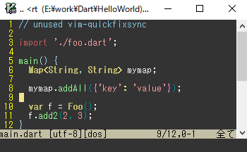
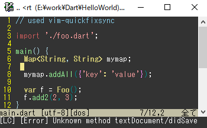

# vim-quickfixsync

Automatically synchronize sign and textprop from `quickfix list` for Vim.

# What is this?

Displays the sign and textprop according to the quickfix list.

For example, the result of QuickRun.


Also, some LSP plugins have this feature, but if there is a discrepancy in the display using the quickfix list, this plugin will correct it to the correct result.

For example, LanguageClient-neovim for dart with analysis_server.

 → 


# Installing

For [vim-plug](https://github.com/junegunn/vim-plug) plugin manager:

```vim
Plug 'wordijp/vim-quickfixsync'
```

# Usage

It works by default.

If you want to change the default:

```vim

" Auto enable at startup, 1 or 0
" Default: 1
let g:quickfixsync_auto_enable = 0

" Synchronize quickfix list type, `Location` or `Quickfix`.
" Default: 'Quickfix'
let g:quickfixsync_qftype = 'Location'

" hilight names by error type
" Default: original
"  1: QFSyncError
"  2: QFSyncWarning
"  3: QFSyncInformation
"  4: QFSyncHint
" You can also specify existing highlights to make them look the same.
let g:quickfixsync_signname_map = {
\ 1: 'LanguageClientError',
\ 2: 'LanguageClientWarning',
\ 3: 'LanguageClientInformation',
\ 4: 'LanguageClientHint',
\ }

" sign texts by error type
" Default:
"   1: 'E'
"   2: 'W'
"   3: 'I'
"   4: 'H'
" vim-lsp like
let g:quickfixsync_text_map = {
\ 1: 'E>',
\ 2: 'W>',
\ 3: 'I>',
\ 4: 'H>',
\ }

" ON/OFF switching, 1 or 0
" Default: 1 (if supported each)
let g:quickfixsync_signs_enabled = 1
let g:quickfixsync_textprop_enabled = 1

```

# How to use with QuickRun

Run with `autocmd BufReadPost quickfix ...` , but if it doesn't work please add this to vimrc.

```vim
let s:hook = {
\ "name": 'quickfixsync',
\ 'kind': 'hook',
\ }

function! s:hook.on_exit(...)
  call quickfixsync#update()
endfunction

call quickrun#module#register(s:hook, 1)
unlet s:hook
```

# License

MIT
